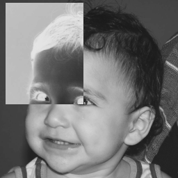
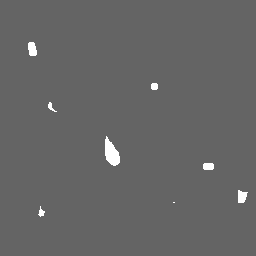

:numbered:
:author: Iago Lucas <iagolucas88@gmail.com> Emerson Matheus <emdantasc@bct.ect.ufrn.br>
:icons:
:experimental:
:stem:
:imagesdir: 
:toc: left
:doctype: book
:source-highlighter: pygments
:caution-caption: Cuidado
:important-caption: Importante
:note-caption: Nota
:tip-caption: Dica
:warning-caption: Aviso
:appendix-caption: Apêndice
:example-caption: Exemplo
:figure-caption: Figura
:listing-caption: Listagem
:table-caption: Tabela
:toc-title: Sumário
:preface-title: Prefácio
:version-label: Versão
:last-update-label: Última atualização

= DCA0445: Processamento Digital de Imagens =

== Introduction ==

This page refers to a tutorial of some OpenCV functions and its effects on images.

Link github (link:d)

== First Unit ==
=== Negative ===
==== Objective ====
This program will take an image, and the user will determine a region passing coordenates. This region will be the negative of the original image.

==== Code ====
[[exa_regions, Regions]]
[source,cpp]
.regions.cpp
----
include::regions.cpp[]
----

The code (link:regions.cpp[]) read an image, so a user determine coordenates for _P1_ and _P2_. This region becames the negative by subtrating in each analized pixel (_image.at<uchar>(i,j) = 255 - image.at<uchar>(i, j);_).

==== Results ====
[[fig_biel, Biel]]
//[.text-center]
.Original Image
image::biel.png[Original Image, title="Original Image"]

[[fig_negative, Negative]]
//[.text-center]
.New Image

=== Exchange Regions ===
==== Objective ====
This program will take an image, and swap the first 
quadrant with the third 
quadrant, as well the second 
quadrant with the forth 
quadrant.

==== Code ====
[[exa_trocaregioes, Exchange Regions]]
[source,cpp]
.trocaregioes.cpp
----
include::trocaregioes.cpp[]
----

The code (link:trocaregioes.cpp[]) read an image and find the center point by dividing the number of rows and colums by two. The point is used to separete the four quadrants. 
The image is copied and used as an auxiliary, so the swap can be done. 

==== Results ====
[[fig_troca, Troca]]
//[.text-center]
.Original Image
image::biel.png[Original Image, title="Original Image"]

[[fig_negative, Negative]]
//[.text-center]
.Output Image
image::troca.png[Output Image, title="Exchanged Quadrants"]

=== Objects Counter ===
==== Objective ====
This program will count the number os objects contained in an image, remove those that touch the borders and count the numbers of holls in the objects.

[[exa_labeling, Objects Counter]]
[source,cpp]
.labeling.cpp
----
include::labeling.cpp[]
----

The code (link:labeling.cpp[]) read an image and analize the value of each pixel. When it finds a determinated color (255), aplly the .
So each time the pixel is finded, add to a conter (_nobjects_) a new object. 
To avoid misscounting, the function _cv::floodFill();_ is apllied on that object.
This function change the color of the pixels that has the same value and are next of the analized pixel for a determinated color (100).
After the borders objects are removed and the program count the numbers of holls present on the image.

==== Results ====
[[fig_bolhas, Troca]]
//[.text-center]
.Original Image
image::bolhas.png[Original Image, title="Original Image"]

[[fig_labeling, Labeling]]
//[.text-center]
.Output Image

=== Equalizer ===
==== Objective ====
This program will count the number os objects contained in an image, remove those that touch the borders and count the numbers of holls in the objects.

==== Code ====
[[exa_labeling, Objects Counter]]
[source,cpp]
.labeling.cpp
----
include::labeling.cpp[]
----

The code (link:labeling.cpp[]) read an image and analize the value of each pixel. When it finds a determinated color (255), aplly the .
So each time the pixel is finded, add to a conter (_nobjects_) a new object. 
To avoid misscounting, the function _cv::floodFill();_ is apllied on that object.
This function change the color of the pixels that has the same value and are next of the analized pixel for a determinated color (100).
After the borders objects are removed and the program count the numbers of holls present on the image.

==== Results ====
[[fig_bolhas, Troca]]
//[.text-center]
.Original Image
image::bolhas.png[Original Image, title="Original Image"]

[[fig_labeling, Labeling]]
//[.text-center]
.Output Image

nao da certo
s

A saída do programa _hello_ é mostrado na Figura <<fig_hello>>

[[fig_hello, Hello]]
//[.text-center]
.Saída do programa hello
image::figs/negative.png[Saida do programa hello, title="Saída do programa hello"]

Aqui vem a listagem do programa link:exemplos/hello.cpp[] , mostrada
Listagem <<exa_hello>>, cuja única funcionalidade apresentar na tela
uma imagem fornecida via linha de comando.
    
[[exa_hello, Hello]]
[source,cpp]
.hello.cpp
----
include::hello.cpp[]
----

== Bibliografia ==
[bibliography]
- Stephen Prata. 'C++ Primer Plus'. Addison-Wesley. 1990. 2 ed.
- http://www.cplusplus.com. 'Principal portal de desenvolvimento e referência para programação em C++'.
