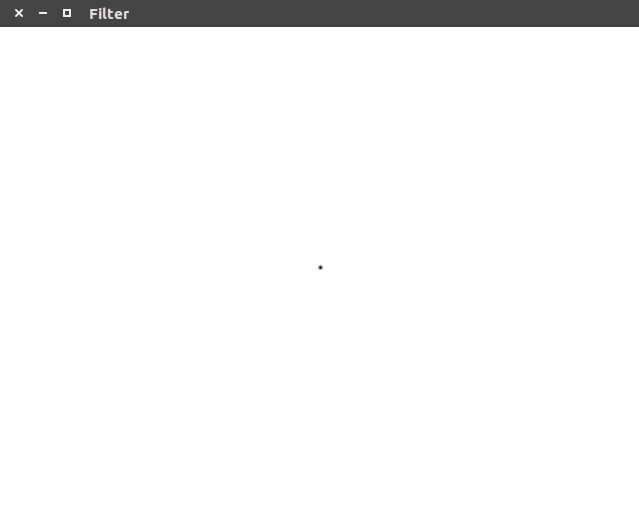
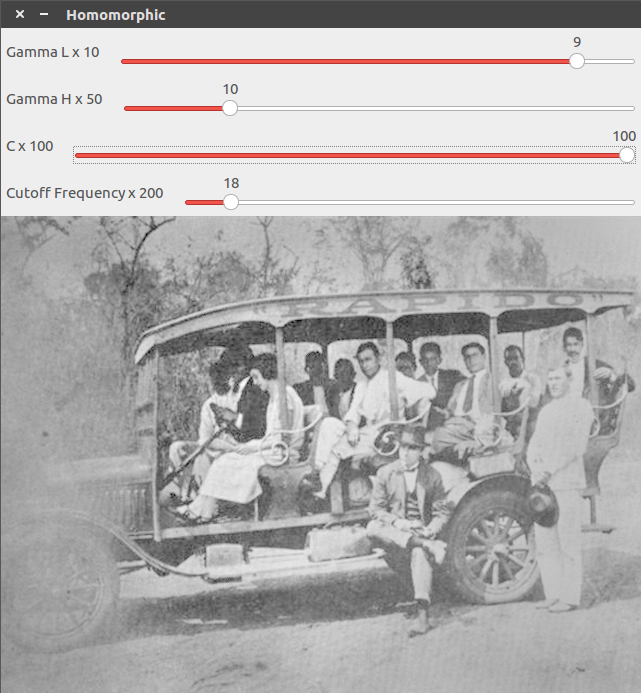
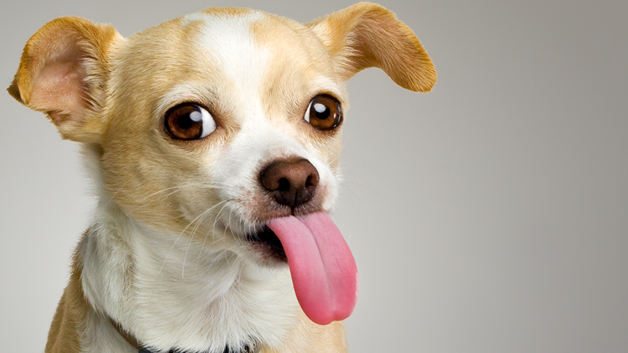
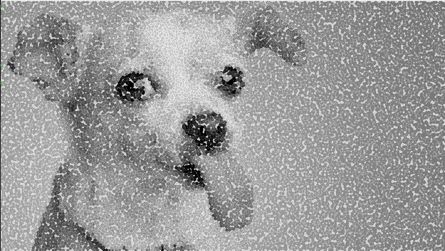

:numbered:
:author: Iago Lucas <iagolucas88@gmail.com> Emerson Matheus <emdantasc@bct.ect.ufrn.br>
:icons:
:experimental:
:stem: asciimath
:imagesdir: 
:toc: left
:doctype: book
:source-highlighter: pygments
:caution-caption: Cuidado
:important-caption: Important
:note-caption: Note
:tip-caption: Tip
:warning-caption: Warning
:appendix-caption: Apêndice
:example-caption: Exemple
:figure-caption: Figure
:listing-caption: Code
:table-caption: Comparation
:toc-title: Index
:preface-title: Preface
:version-label: Version
:last-update-label: Last Update

= DCA0445: Processamento Digital de Imagens =

== Preface ==
This tutorial shows and explain some image digital processing concepsts, using the artificial vision library OpenCV (C++).
All the following codes were produced and tested using Ubuntu (Unix Distribution). However, they should work well in others Operational Systems. 

This page was build to report all the results of assignments on the Image Digital Processing course of Universidade Federal do Rio Grande do Norte (Brazil), on Mecatronis Engeneering graduation. 
The followings exercises are commented and described for amateur programmers.
All the files for these excersises are available on github (https://github.com/iagolucas88/iagolucas88.git).

Sugestions, criticism and/or contributions are quite welcome. So, if you are interest in send something to me, my main contact is iagolucas88@gmail.com.

== Initial Concepts ==

== First Unit - Space Domain ==
Firsts steps on OpenCV library. On this unit, we will describe some examples of OpenCV functions on space domain.

=== Negative ===
==== Objective ====
This program will take an image, and the user will determine a region passing coordenates. This region will be the negative of the original image.

[[exa_regions, Regions]]
[source,cpp]
.regions.cpp
----
include::regions.cpp[]
----

==== Description ====
The code (link:regions.cpp[]) reads an image, so a user determine coordenates for _P1_ and _P2_. This region becames the negative by subtrating in each analized pixel (_image.at<uchar>(i,j) = 255 - image.at<uchar>(i, j);_).

==== Result ====
[[fig_biel, Biel]]
//[.text-center]
.Original Image
image::biel.png[Original Image, title="Original Image"] 
[[fig_biel, Biel]]
//[.text-center]
.Negative Image Region
image::negative.png[Output Image, title="Negative Region"]

=== Exchange Regions ===
==== Objective ====
This program will take an image, and swap the first 
quadrant with the third 
quadrant, as well the second 
quadrant with the forth 
quadrant.

[[exa_trocaregioes, Exchange Regions]]
[source,cpp]
.trocaregioes.cpp
----
include::trocaregioes.cpp[]
----

==== Description ====
The code (link:trocaregioes.cpp[]) reads an image and find the center point by dividing the number of rows and colums by two. The point is used to separete the four quadrants. 
The image is copied and used as an auxiliary, so the swap can be done. 

==== Result ====
[[fig_biel, Troca]]
//[.text-center]
.Original Image
image::biel.png[Output Image, title="Original Image"]
[[fig_biel, Troca]]
//[.text-center]
.Exchanged Image 
image::troca.png[Output Image, title="Exchanged Image"]

=== Objects Counter ===
==== Objective ====
This program will count the number os objects contained in an image, remove those that touch the borders and count the numbers of holls in the objects.

[[exa_labeling, Labeling]]
[source,cpp]
.labeling.cpp
----
include::labeling.cpp[]
----

==== Description ====
The code (link:labeling.cpp[]) reads an image and analize the value of each pixel. When it finds a determinated color (255), aplly the .
So each time the pixel is finded, add to a conter (_nobjects_) a new object. 
To avoid misscounting, the function _cv::floodFill();_ is apllied on that object.
This function change the color of the pixels that has the same value and are next of the analized pixel for a determinated color (100).
After the borders objects are removed and the program count the numbers of holls present on the image.

==== Result ====
[[fig_bolhas, Troca]]
//[.text-center]
.Original Image
image::bolhas.png[Output Image, title="Filled Image"] 
[[fig_bolhas, Troca]]
//[.text-center]
.Contered Image
image::labeling.png[Output Image, title="Filled Image"]

=== Equalizer ===
==== Objective ====
This program will reads and image and equilize the histogram to redistributing each pixel color. This will highlight the colors, so the details will be more explicity.

[[exa_equalize, Equilizer]]
[source,cpp]
.equalize.cpp
----
include::equalize.cpp[]
----

==== Description ====
The code (link:equalize.cpp[]) reads an image and analize the value of each pixel. When it finds a determinated color (255), aplly the .
So each time the pixel is finded, add to a conter (_nobjects_) a new object. 
To avoid misscounting, the function _cv::floodFill();_ is apllied on that object.
This function change the color of the pixels that has the same value and are next of the analized pixel for a determinated color (100).
After the borders objects are removed and the program count the numbers of holls present on the image.

==== Result ====
[[fig_histogram, Histogram]]
//[.text-center]
.Image's Histogram
image::histogram.gif[Original Image, title="Image's Histogram"] 

[[fig_histogram, Histogram]]
//[.text-center]
.Equalized Image's Histogram
image::equalize.gif[Output Image, title="Equalized Image's Histogram"]

=== Motion Detector ===
==== Objective ====
This program is abel to monitore an ambient and detect a change of the captured image from the image before. 

[[exa_motiondetector, Motion Detector]]
[source,cpp]
.motiondetector.cpp
----
include::equalize.cpp[]
----

==== Description ====
The code (link:motiondetector.cpp[]) reads an image and calculate the histogram of the green plan. Using this as a model for the next captured image, by the difference between them, it is possible do detect a change on the image.

==== Results ====
[[fig_motiondetecor, Motion Detector]]
//[.text-center]
.Motion detection
image::motiondetector.gif[Motion Detector, title="Motion detection"]

=== Spacial Filter 1 ===
==== Objective ====
This program pass a filter in an image that will blur or detect borders from different directions. 

[[exa_laplgauss, Laplacian & Gauss]]
[source,cpp]
.laplgauss.cpp
----
include::laplgauss.cpp[]
----

==== Description ====
The code (link:laplgauss.cpp[]) reads an image and choosing the filter using a menu, the image is filtered by the aplied mask and the result is shown on the screen.

==== Results ====
[[fig_laplgauss, Filter]]
//[.text-center]
.Filtering
image::laplgauss.gif[Original Image, title="Spacial Filter"]

=== Tilt Shift ===
==== Objective ====
This program pass a filter in an image that will blur or detect borders from different directions. 

[[exa_tiltshift, Tilt Shift]]
[source,cpp]
.tiltshift.cpp
----
include::tiltshift.cpp[]
----

==== Description ====
The code (link:tiltshift.cpp[]) reads an image and choosing the filter using a menu, the image is filtered by the aplied mask and the result is shown on the screen.

==== Results ====
[[fig_tiltshift, Tilt Shift]]
//[.text-center]
.Tilt Shift
image::tiltshift.gif[Original Image, title="Tilt Shift"]

== Second Unit - Frequency Domain ==
In this chapter we are focused on the implementation of two image processing
methods. The first one is based on the implementation of a linearized bidimensional
representation of the image in the Fourier Universe. In the second part we are
going to apply a segmentation algorithm called “Canny Edge Detector” and then use
this method to develop artistic images using the pointillism style, generated by 
another algorithm whom uses the one previously mentioned.

=== Homomorphic ===
==== Objective ====
The Homomorphic Filter uses the luminosity based model of image representation. In
this one the image is constructed by the multiplication of two bidimensional 
signals that contains the lower and higher frequency luminosity components the
Luminance and Reflectance, respectively.

Since we’re intending to work directly on the frequency domain, the usual
procedure is to transform from the space signal through a frequency signal using
the Fourier Transform. Due to the composition of the signal as expressed 
below, some mathematical manipulation is needed.
["asciimath",align="right"]
[stem]
++++
^{(I)}im(x,y) = i(x,y)*r(x,y) 
++++

[stem]
++++
^{(II)}ln[im(x,y)] = ln[i(x,y)*r(x,y)] 
++++

[stem]
++++
^{(III)}ln[im(x,y)]=ln[i(x, y)] + ln[r(x, y)] 
++++

[stem]
++++
^{(IV)}imlin(x,y)=ilin(x,y)+rlin(x,y)
++++
	
Applying the Fourier Transform we end-up with the following results:

[stem]
++++
^{(V)}F\{im_{lin}(x,y)\}=F\{i_{lin}(x,y)+r_{lin}(x,y)\}
++++

[stem]
++++
^{(VI)}IM_{lin}(u,v)=I_{lin}(u,v)+R_{lin}(u,v)
++++

Allowing us to apply the convolution theorem in this domain and easily manipulate 
the frequency components and acquire therefore a treated image by using the reverse
Fourier Transform in the processed signal, as seen below:
[stem]
++++
^{(VII)}U(u,v)=G(u,v).IMlin(u,v)
++++

stem: []

Referring to U(u,v) as the treated signal, and G(u,v) as a filter designed to 
attenuate unwanted frequency components in the image spectrum.

[[exa_homomorfico, Homomorphic]]
[source,cpp]
.homomorfico.cpp
----
include::homomorfico.cpp[]
----

==== Description ====
(description here)

==== Result ====
[[fig_filtro, Filter]]
//[.text-center]
.Filter  	
 

[[fig_homomorfico, Homomorphic Original]]
//[.text-center]
.Original Image
image::original_homomorphic.jpg1[Original Image, title="Original Image"]

[[fig_homomorfico, Homomorphic]]
//[.text-center]
.Homomophic Image 

=== Canny and Pointillism ===
==== Objective ====
(description here)

[[exa_cannypoints, Canny and Pointillism]]
[source,cpp]
.cannypoints.cpp
----
include::cannypoints.cpp[]
----

==== Description ====
(description here)

[[fig_dog, Original]]
//[.text-center]
.Original Image

==== Result ====
[[fig_pontilista, Pointllism]]
//[.text-center]
.Pointllism 	
image::pointilista.png[Pointllism , title="Pointllism"] 

[[fig_cannypoints, Homomorphic]]
//[.text-center]
.Canny and Pointllism Image 

== Bibliografia ==
[bibliography]
- Stephen Prata. 'C++ Primer Plus'. Addison-Wesley. 1990. 2 ed.
- http://www.cplusplus.com. 'Principal portal de desenvolvimento e referência para programação em C++'.
